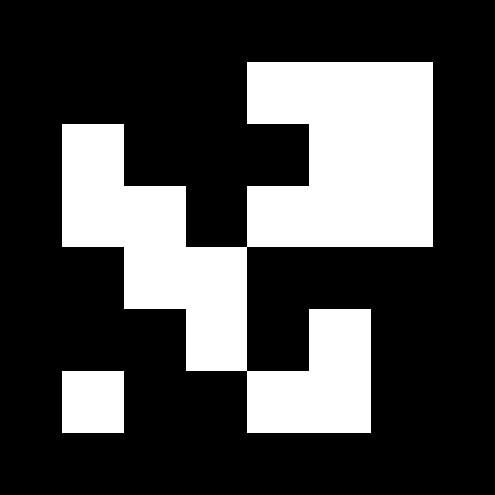

# Mothership

A ROS 2 workspace for a multi-agent robotics testbed. DJI RoboMaster robots are localized via overhead cameras using ArUco markers, fused through an Extended Kalman Filter, and driven by various control strategies including proportional control, repulsive avoidance, and Conflict-Based Search (CBS) multi-agent path planning.

## Repository Structure

```
src/
├── localization/          # Camera-based ArUco localization + EKF fusion
├── control/               # Motion control and path planning
└── aruco_marker_stuff/    # Standalone calibration & marker utilities
```

## Running the System

### Prerequisites

- ROS 2 Humble
- Two overhead USB cameras plugged into the laptop
- The cameras are already calibrated for the desktop setup — if you are running two cameras from the desktop, **no recalibration is needed**. Only recalibrate if you change cameras or mounting positions (see [Camera Calibration](#camera-calibration) below).
- All robots powered on and on the same network as the laptop

### Origin Marker

Both cameras **must** be able to see **Marker 0** at all times. This marker defines the world-frame origin (the (0, 0) position with X and Y axes). Place it flat on the ground in the center of the operating area before launching anything.

Marker 0 looks like this:



It is a 6x6 ArUco marker (DICT_6X6_250, ID 0). Print it at a known size (the code expects the physical side length to match the calibration).

### Step-by-Step Workflow

You need **three terminal windows**:

#### Terminal 1 — Localization pipeline

```bash
ros2 launch localization launch.xml
```

This starts both camera publishers and the `dual_camera_detection` node. Once running, you should see `/pose_N` topics being published for every detected robot marker. The cameras should be able to see the origin marker0, they will print out in the terminal once that happens.

#### Terminal 2 — rviz2 (visualization)

```bash
rviz2
```

Open rviz2 and subscribe to the relevant topics (`/fused_pose_N`, `/goal_pose_N`, etc.) to visualize robot positions and directions in real time.

#### Terminal 3 — Control algorithm

Launch whichever control strategy you want. Each launch file includes `move_to_goal` alongside the planner, so you only need one command:

```bash
# CBS swap planner (robots swap positions via collision-free paths)
ros2 launch control swap.xml

# CBS with hardcoded start/goal positions
ros2 launch control cbslaunch.xml

# Simple rotation test pattern
ros2 launch control launch.xml

# Formation (vertical line with 0.6 m spacing)
ros2 launch control formation_vertical.xml

# Formation (horizontal line with 0.6 m spacing)
ros2 launch control formation_horizontal.xml

# Smoke test (single agent moves dx/dy and returns)
ros2 launch control smoke_test.xml agent_id:=4 dx:=0.3 dy:=0.0
```

I usually run the smoke_test before anything else to see if i can control the robots programmaticaly through these control algs.

For `repulsive_avoidance` (not in a launch file), run it directly — it publishes cmd_vel itself without needing `move_to_goal`:

```bash
ros2 run control repulsive_avoidance
```

## The Swap Planner (`swap_planner`)

The swap planner automatically discovers active agents, plans collision-free paths for them to swap positions in a cycle, and executes the plan. It goes through these phases:

### Phases

1. **DISCOVER** — Listens on `/fused_pose_N` for candidate agent IDs (1, 2, 3, 4, 7). After a 3-second timeout, any agents that responded are included.

2. **WAIT / PLAN** — Reads each agent's current position and maps it to a grid cell. Builds a **cyclic swap** — each agent's goal is the next agent's current position (agent 1 → agent 2's spot, agent 2 → agent 1's spot for 2 agents). Runs CBS to plan collision-free paths.

3. **ALIGN** — Before executing the planned path, drives each robot to the exact center of its starting grid cell with yaw = 0. This ensures the initial conditions match what CBS assumed. Waits until all robots are within 5 cm and 0.1 rad of their targets.
Ideally we'd remove this at some point later on

4. **EXECUTE** — Steps through the CBS path one waypoint at a time (every 1 second by default). Each waypoint is a grid cell coordinate converted back to world coordinates and published to `/goal_pose_N`.

5. **DONE** — All waypoints have been published. Robots hold their final positions.

### Example Output

When you run `ros2 launch control swap.xml` with two robots:

```
[INFO] swap_planner: DISCOVER phase — listening for candidates [1, 2, 3, 4, 7], timeout=3.0s
[INFO] All 2 candidates detected early: [1, 2]
[INFO] Discovery complete: 2 agents [1, 2]; grid cell=0.48 m, min_separation=1.00 cells, CBS bounds ±5
[INFO]   Cyclic swap: {1: 2, 2: 1}
[INFO] Planning CBS cyclic swap (2 agents):
[INFO]   Agent 1: (0, 1) → (1, 0) (agent 2's spot)
[INFO]   Agent 2: (1, 0) → (0, 1) (agent 1's spot)
[CBS] Starting: 2 agents, min_sep=1.00, max_iter=500, timeout=10.0s
[CBS]   starts={1: (0, 1), 2: (1, 0)}
[CBS]   goals ={1: (1, 0), 2: (0, 1)}
[CBS] SOLVED in 3 iterations, 0.01s, cost=6
[INFO]   Agent 1 path: [(0, 1), (0, 0), (1, 0), (1, 0)]
[INFO]   Agent 2 path: [(1, 0), (1, 1), (0, 1), (0, 1)]
[INFO] ALIGN phase: robots moving to grid cell centers with yaw=0.
[INFO] ALIGN complete. Starting CBS path execution.
[INFO] Swap complete. Holding final goals.
```

The paths are arrays of `(grid_x, grid_y)` coordinates — one per timestep. Each cell is 0.48 m wide (one robot diagonal with safety margin). The robots avoid each other by taking different routes around the grid.

### When CBS Fails

CBS may fail to find a solution if:
- Robots are too close together (mapping to the same grid cell)
- The grid is too small for the number of agents to navigate without conflict
- The problem is too constrained (many agents in a tight space)

When this happens you'll see:
```
[CBS] TIMEOUT after 500 iterations, 10.00s...
[CBS-fallback] Trying point-particle CBS (min_sep=0)...
```

If even the fallback fails:
```
[ERROR] CBS found no swap solution.
```

In this case, manually move the robots further apart and try again.

### Differences from Standard CBS

This implementation extends the standard CBS algorithm in several ways:

| Feature | Standard CBS | This Implementation |
|---------|-------------|---------------------|
| **Collision model** | Point particles (vertex/edge conflicts only) | Swept-volume with minimum separation distance based on robot physical dimensions (0.48 m = robot diagonal × 1.2 safety factor) |
| **Conflict detection** | Checks discrete positions at each timestep | Also checks minimum distance along the continuous line segment between timesteps (`_min_segment_dist`) |
| **Timeout / fallback** | Runs until solved or exhausted | Wall-clock timeout (10 s) + iteration cap (500). Falls back to point-particle CBS if swept-volume mode times out |
| **Grid sizing** | Fixed | Cell size derived from robot physical dimensions (DJI RoboMaster EP: 320 × 240 mm diagonal + safety margin) |

## Packages

### `localization`

Handles the full perception pipeline — from raw camera frames to fused robot poses.

**Nodes:**

| Node                    | Description                                                                                                                                                                                             |
| ----------------------- | ------------------------------------------------------------------------------------------------------------------------------------------------------------------------------------------------------- |
| `camera0_publisher`     | Captures frames from webcam 0 and publishes to `/camera0/image_raw`                                                                                                                                     |
| `camera1_publisher`     | Captures frames from webcam 1 and publishes to `/camera1/image_raw`                                                                                                                                     |
| `dual_camera_detection` | Detects ArUco markers in both camera feeds, establishes a world frame from marker 0, computes world-frame poses for robot markers (1–N), and fuses detections from both cameras. Publishes to `/pose_N` |
| `velocity_fusion`       | Subscribes to robot linear velocity and IMU attitude, computes angular velocity, and publishes fused body-frame twist to `/twist_N`                                                                     |
| `ekf`                   | Extended Kalman Filter fusing global pose observations (`/pose_N`) with body-frame velocities (`/twist_N`). Publishes smoothed pose to `/fused_pose_N`                                                  |
| `pose_visualizer`       | Real-time matplotlib 2D visualization of raw and fused poses for all agents                                                                                                                             |

**Launch file — `src/localization/launch/launch.xml`:**
Launches both cameras and the dual camera detection node.

### `control`

Motion control nodes that subscribe to localized poses and drive the robots.

**Nodes:**

| Node                    | Description                                                                                                                                                                                                                          |
| ----------------------- | ------------------------------------------------------------------------------------------------------------------------------------------------------------------------------------------------------------------------------------ |
| `move_to_goal`          | **Main control node.** Subscribes to `/goal_pose_N` and `/fused_pose_N`, uses P-control in the robot body frame to drive each agent to its goal. Configurable gains, velocity limits, and tolerances. Stops if poses go stale (>1 s). Drives along one axis at a time (cardinal motion). |
| `swap_planner`          | Auto-discovers active agents, plans a cyclic swap with CBS, aligns robots to grid cells, then executes the planned paths step-by-step                                                                                                |
| `simple_rotation`       | Test node that publishes a looping sequence of goal poses to `/goal_pose_1` and `/goal_pose_2`                                                                                                                                       |
| `cbs_scenario`          | Runs CBS with hardcoded start/goal positions and publishes waypoints to `/goal_pose_N`                                                                                                                                               |
| `stay_in_place`         | P-controller that drives each agent to a fixed target position                                                                                                                                                                       |
| `repulsive_avoidance`   | Goal-seeking with inter-agent repulsive force avoidance. Press Enter to swap targets                                                                                                                                                 |
| `teleop_twist_keyboard` | Keyboard teleoperation for both robots simultaneously                                                                                                                                                                                |

**Support module — `cbs.py`:**
Implements Conflict-Based Search (CBS) for multi-agent pathfinding with A* search, vertex/edge constraints, swept-volume conflict detection, and timeout fallback.

**Launch files:**

| File | Launches |
| ---- | -------- |
| `swap.xml` | `move_to_goal` + `swap_planner` |
| `cbslaunch.xml` | `move_to_goal` + `cbs_scenario` |
| `launch.xml` | `move_to_goal` + `simple_rotation` |
| `formation_vertical.xml` | `move_to_goal` + `formation` (vertical, 0.6 m spacing) |
| `formation_horizontal.xml` | `move_to_goal` + `formation` (horizontal, 0.6 m spacing) |
| `smoke_test.xml` | `move_to_goal` + `smoke_test` (single agent, configurable dx/dy) |

### `aruco_marker_stuff`

Standalone OpenCV scripts (not a ROS 2 package) for ArUco marker generation and camera calibration.

| Script                 | Description                                                                                                          |
| ---------------------- | -------------------------------------------------------------------------------------------------------------------- |
| `generate_marker.py`   | Generates ArUco markers 0–9 (DICT_6X6_250) as PNG images                                                             |
| `generate_charuco.py`  | Generates a ChArUco calibration board image                                                                          |
| `capture_charuco.py`   | Interactive webcam capture tool for collecting calibration images (press `s` to save, `q` to quit)                   |
| `calibrate_charuco.py` | Runs camera calibration from captured ChArUco images, saves results to `calibration.json`                            |
| `detection.py`         | Real-time ArUco detection and pose estimation — marker 0 defines the world frame, marker 1 is tracked relative to it |

Also contains pre-generated marker images (`marker_0.png`–`marker_9.png`), a ChArUco board image, captured calibration images in `charuco_images/`, and saved calibration data.

## Camera Calibration

Only needed if you change cameras or mounting. Use the scripts in `aruco_marker_stuff/`:

1. Print a ChArUco board with `generate_charuco.py`
2. Capture calibration images with `capture_charuco.py`
3. Run calibration with `calibrate_charuco.py`

## Topic Flow

```
Physical Cameras
    ├─ camera0_publisher ──→ /camera0/image_raw ──┐
    └─ camera1_publisher ──→ /camera1/image_raw ──┤
                                                   ↓
                                    dual_camera_detection
                                           │
                                           └──→ /pose_N
                                                   │
    RoboMaster Robots                              │
    ├─ /robomaster_N/vel ──────┐                   │
    └─ /robomaster_N/attitude ─┤                   │
                               ↓                   │
                        velocity_fusion            │
                               │                   │
                               └──→ /twist_N       │
                                       │           │
                                       ↓           ↓
                                         ekf
                                          │
                                          └──→ /fused_pose_N
                                                    │
                             ┌──────────────────────┤
                             ↓                      ↓
                      pose_visualizer       move_to_goal
                                                    │
                                                    └──→ /robomaster_N/cmd_vel
                                                              │
                                                              ↓
                                                        Physical Robots

    Goal sources → /goal_pose_N → move_to_goal:
    ├─ swap_planner      (CBS cyclic swap)
    ├─ simple_rotation   (cyclic test pattern)
    └─ cbs_scenario      (CBS-planned paths)
```
